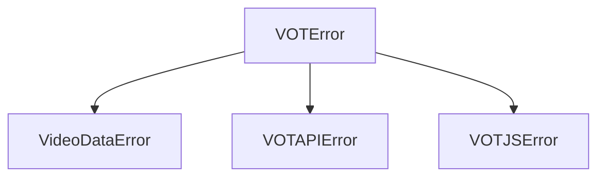

# yavot-py API Documentation

This document provides a detailed API reference for developers using the `yavot-py` library.

---

## Table of Contents
1. [Core Clients](#core-clients)
   - [VOTClient (Async)](#votclient-async)
   - [VOTClientSync (Sync)](#votclientsync-sync)
   - [VOTWorkerClient (Worker Proxy)](#votworkerclient-worker-proxy)
2. [Data Models](#data-models)
   - [VideoData](#videodata)
   - [TranslationResponse](#translationresponse)
   - [GetSubtitlesResponse](#getsubtitlesresponse)
3. [Core Functions & Utilities](#core-functions--utilities)
   - [get_video_data](#get_video_data)
   - [convert_subs](#convert_subs)
4. [Exceptions](#exceptions)

---

## Core Clients

### `VOTClient` (Async)
The main client used to interact asynchronously with Yandex Video Translation APIs. It is built on top of `httpx.AsyncClient`.

#### Constructor
```python
from vot import VOTClient
import httpx

client = VOTClient(
    client: httpx.AsyncClient | None = None,
    request_lang: str = "en",
    response_lang: str = "ru",
    host: str = "frontend.vh.yandex.ru",
)
```
* `client`: An optional instance of `httpx.AsyncClient`. If not provided, a temporary one will be spun up per request (not recommended for production).
* `request_lang`: Default source language code (e.g. `"en"`).
* `response_lang`: Default target language code (e.g. `"ru"`).
* `host`: Yandex API endpoint domain.

#### Methods

##### `async translate_video`
Requests a translation for a resolved video.
```python
async def translate_video(
    self,
    video_data: VideoData,
    request_lang: str | None = None,
    response_lang: str | None = None,
    translation_help: list[VideoTranslationHelpObject] | None = None,
    headers: dict[str, str] | None = None,
    extra_opts: dict[str, Any] | None = None,
    should_send_failed_audio: bool = True,
) -> TranslationResponse:
```
* Returns: [TranslationResponse](#translationresponse)
* Raises: `VOTAPIError` if request fails, `VOTJSError` if Yandex returns unexpected status.
* Note: If `should_send_failed_audio` is `True`, the client automatically sends a mock failure payload (`fail-audio-js`) to kick off voiceover generation for newly submitted YouTube videos.

##### `async get_subtitles`
Fetches a list of original and machine-translated subtitles.
```python
async def get_subtitles(
    self,
    video_data: VideoData,
    request_lang: str | None = None,
    headers: dict[str, str] | None = None,
) -> GetSubtitlesResponse:
```
* Returns: [GetSubtitlesResponse](#getsubtitlesresponse)

##### `async translate_stream`
Requests stream translation for a live broadcast URL.
```python
async def translate_stream(
    self,
    video_data: VideoData,
    request_lang: str | None = None,
    response_lang: str | None = None,
    headers: dict[str, str] | None = None,
) -> StreamTranslationResponse:
```

##### `async ping_stream`
Sends a keep-alive request for stream translation session.
```python
async def ping_stream(
    self,
    ping_id: int,
    headers: dict[str, str] | None = None,
) -> None:
```

---

### `VOTClientSync` (Sync)
A thread-safe synchronous wrapper around `VOTClient` that manages an event loop under the hood.

#### Usage
```python
from vot import VOTClientSync

# Works as a context manager
with VOTClientSync() as client:
    # Call methods synchronously (signatures match VOTClient)
    res = client.translate_video(video_data)
    print(res.url)
```
* Methods available: `translate_video`, `get_subtitles`, `translate_stream`, `ping_stream`.
* Helper: `client._run(coro)` can be used to run any arbitrary asynchronous coroutine within the client's internal event loop.

---

### `VOTWorkerClient` (Worker Proxy)
A specialized client that routes requests through a Cloudflare Worker proxy host.

#### Constructor
```python
from vot import VOTWorkerClient
import httpx

client = VOTWorkerClient(
    host: str,  # The worker proxy host (e.g. "https://my-worker.example.workers.dev")
    client: httpx.AsyncClient | None = None,
    request_lang: str = "en",
    response_lang: str = "ru",
)
```

---

## Data Models

All data models are defined using `pydantic`. They support both snake_case python attributes and camelCase aliases for serialization.

### `VideoData`
Contains extracted metadata and characteristics of a parsed video URL.
* `url` (`str`): Normalized canonical video URL.
* `video_id` (`str`): Unique ID of the video on the hosting service.
* `host` (`str`): Domain keyword corresponding to the hosting (e.g. `"youtube"`, `"vimeo"`, `"twitch"`, `"custom"`).
* `title` (`str | None`): Video title.
* `duration` (`float | None`): Video duration in seconds.
* `subtitles` (`list[VideoDataSubtitle]`): Local subtitles found on the source page.

### `TranslationResponse`
Represents the status and result of a translation request.
* `translated` (`bool`): `True` if the translated audio is finished and ready.
* `url` (`str | None`): Direct HTTP URL to the generated translated MP3/WAV voice-over.
* `status` (`int`): Yandex status code:
  - `0`: Failed
  - `1`: Finished / Success
  - `2`: Waiting / Processing
  - `3`: Long waiting
  - `5`: Part content
  - `6`: Audio requested (transcribing)
  - `7`: Session required
* `remaining_time` (`int`): Estimated time (seconds) remaining until completion.
* `translation_id` (`str`): Unique identifier of this translation task.
* `message` (`str | None`): Response status description or error message.

### `GetSubtitlesResponse`
Contains available subtitles.
* `waiting` (`bool`): `True` if subtitles are still being fetched/generated on Yandex's end.
* `subtitles` (`list[SubtitleItem]`): List of subtitle items.

#### `SubtitleItem`
* `language` (`str`): Language code of the subtitle (e.g., `"en"`).
* `url` (`str`): Link to the original subtitle.
* `translated_language` (`str | None`): Language code of the translation (e.g., `"ru"`).
* `translated_url` (`str | None`): Link to the Yandex-translated subtitle.

---

## Core Functions & Utilities

### `get_video_data`
Extracts service info and ID from a video URL.
```python
from vot import get_video_data
import httpx

async def get_video_data(
    url: str,
    client: httpx.AsyncClient | None = None,
) -> VideoData:
```
* Supported services: YouTube, Vimeo, Twitch, VK, TikTok, and direct stream links (`"custom"`).
* Throws `VideoDataError` if the service cannot be identified or the ID is malformed.

### `convert_subs`
Converts subtitle formats between JSON, SRT, and VTT.
```python
from vot import convert_subs

# Convert VTT format to SRT string
srt_str = convert_subs(vtt_content, output="srt")

# Convert VTT format to Yandex JSON structure
yandex_json = convert_subs(vtt_content, output="json")
```
* Supported input: raw SRT/VTT string, parsed Yandex JSON dict.
* Supported outputs: `"json"`, `"srt"`, `"vtt"`.

---

## Exceptions

All exceptions inherit from a base `VOTError`.



* `VOTError`: Base exception class.
* `VideoDataError`: Raised when URL matching, ID extraction, or metadata retrieval fails.
* `VOTAPIError`: Raised for HTTP failures during communication with Yandex/Worker hosts.
* `VOTJSError`: Raised when Yandex APIs respond with successful HTTP statuses but return application-level errors (e.g., missing payload fields, invalid protobuf packets).
