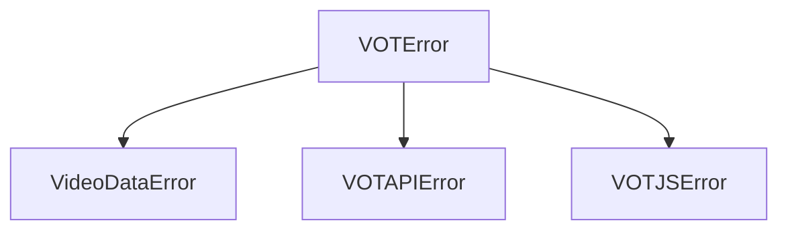

# Документация API библиотеки vot-py

В данном документе приведено детальное описание программного интерфейса (API) библиотеки `vot-py` для разработчиков.

---

## Оглавление
1. [Клиенты API](#клиенты-api)
   - [VOTClient (Асинхронный)](#votclient-асинхронный)
   - [VOTClientSync (Синхронный)](#votclientsync-синхронный)
   - [VOTWorkerClient (Прокси-клиент)](#votworkerclient-прокси-клиент)
2. [Модели данных](#модели-данных)
   - [VideoData](#videodata)
   - [TranslationResponse](#translationresponse)
   - [GetSubtitlesResponse](#getsubtitlesresponse)
3. [Утилиты и глобальные функции](#утилиты-и-глобальные-функции)
   - [get_video_data](#get_video_data)
   - [convert_subs](#convert_subs)
4. [Исключения](#исключения)

---

## Клиенты API

### `VOTClient` (Асинхронный)
Основной класс для асинхронного взаимодействия с API Яндекс Перевода Видео. Работает на основе `httpx.AsyncClient`.

#### Конструктор
```python
from vot import VOTClient
import httpx

client = VOTClient(
    client: httpx.AsyncClient | None = None,
    request_lang: str = "en",
    response_lang: str = "ru",
    host: str = "frontend.vh.yandex.ru",
)
```
* `client`: Экземпляр `httpx.AsyncClient`. Если не передан, то для каждого запроса будет создаваться временное HTTP-соединение (не рекомендуется в продакшене).
* `request_lang`: Исходный язык видео по умолчанию (например, `"en"`).
* `response_lang`: Целевой язык перевода по умолчанию (например, `"ru"`).
* `host`: Домен API Яндекса.

#### Методы

##### `async translate_video`
Запрашивает перевод ранее разрешенного видео.
```python
async def translate_video(
    self,
    video_data: VideoData,
    request_lang: str | None = None,
    response_lang: str | None = None,
    translation_help: list[VideoTranslationHelpObject] | None = None,
    headers: dict[str, str] | None = None,
    extra_opts: dict[str, Any] | None = None,
    should_send_failed_audio: bool = True,
) -> TranslationResponse:
```
* Возвращает: [TranslationResponse](#translationresponse)
* Возбуждает: `VOTAPIError` при ошибках сети/HTTP, `VOTJSError` при неожиданных ответах API.
* Примечание: Если `should_send_failed_audio` равен `True`, библиотека автоматически отправляет сообщение об ошибке аудио-плеера (`fail-audio-js`), если видео запрашивается к переводу впервые. Это активирует запуск генерации перевода Яндексом.

##### `async get_subtitles`
Возвращает список доступных субтитров (как оригинальных, так и переведенных Яндексом).
```python
async def get_subtitles(
    self,
    video_data: VideoData,
    request_lang: str | None = None,
    headers: dict[str, str] | None = None,
) -> GetSubtitlesResponse:
```
* Возвращает: [GetSubtitlesResponse](#getsubtitlesresponse)

##### `async translate_stream`
Инициирует перевод прямого эфира (стрима).
```python
async def translate_stream(
    self,
    video_data: VideoData,
    request_lang: str | None = None,
    response_lang: str | None = None,
    headers: dict[str, str] | None = None,
) -> StreamTranslationResponse:
```

##### `async ping_stream`
Отправляет запрос для поддержания активности (keep-alive) сессии перевода стрима.
```python
async def ping_stream(
    self,
    ping_id: int,
    headers: dict[str, str] | None = None,
) -> None:
```

---

### `VOTClientSync` (Синхронный)
Потокобезопасная синхронная обёртка вокруг `VOTClient`, управляющая собственным циклом событий (event loop) под капотом.

#### Использование
```python
from vot import VOTClientSync

# Поддерживает протокол контекстного менеджера
with VOTClientSync() as client:
    # Вызовы методов идентичны асинхронным, но выполняются блокирующе
    res = client.translate_video(video_data)
    print(res.url)
```
* Доступные методы: `translate_video`, `get_subtitles`, `translate_stream`, `ping_stream`.
* Вспомогательный метод: `client._run(coro)` позволяет выполнить любую асинхронную сопрограмму (coroutine) внутри внутреннего цикла событий клиента.

---

### `VOTWorkerClient` (Прокси-клиент)
Специализированный клиент для работы через Cloudflare Worker прокси-сервер.

#### Конструктор
```python
from vot import VOTWorkerClient
import httpx

client = VOTWorkerClient(
    host: str,  # URL-адрес прокси-воркера (например, "https://my-worker.example.workers.dev")
    client: httpx.AsyncClient | None = None,
    request_lang: str = "en",
    response_lang: str = "ru",
)
```

---

## Модели данных

Все модели данных описаны с использованием библиотеки `pydantic`. Они поддерживают как змеиный регистр (snake_case) для Python, так и верблюжий регистр (camelCase) для сериализации/десериализации ответов API.

### `VideoData`
Результат парсинга URL-адреса видео. Содержит метаданные и идентификаторы.
* `url` (`str`): Канонический нормализованный URL-адрес видео.
* `video_id` (`str`): Идентификатор видео на хостинге.
* `host` (`str`): Ключевое имя хостинга (например, `"youtube"`, `"vimeo"`, `"twitch"`, `"custom"`).
* `title` (`str | None`): Название видео.
* `duration` (`float | None`): Длительность видео в секундах.
* `subtitles` (`list[VideoDataSubtitle]`): Локальные субтитры, найденные на странице видео.

### `TranslationResponse`
Статус перевода видеоролика.
* `translated` (`bool`): Указывает, готов ли аудиофайл перевода (`True` / `False`).
* `url` (`str | None`): Ссылка на скачивание сгенерированного аудиофайла (MP3/WAV).
* `status` (`int`): Код статуса ответа от Яндекса:
  - `0`: Ошибка / Сбой
  - `1`: Завершено (Успех)
  - `2`: В очереди (Обработка)
  - `3`: Длительное ожидание
  - `5`: Частичный контент
  - `6`: Запрос аудио (транскрипция/синтез)
  - `7`: Требуется сессия
* `remaining_time` (`int`): Оставшееся время до окончания перевода в секундах.
* `translation_id` (`str`): Уникальный ID задачи перевода.
* `message` (`str | None`): Описание статуса или текст ошибки.

### `GetSubtitlesResponse`
Содержит список доступных субтитров.
* `waiting` (`bool`): `True`, если генерация субтитров на стороне Яндекса еще не завершена.
* `subtitles` (`list[SubtitleItem]`): Доступные субтитры.

#### `SubtitleItem`
* `language` (`str`): Язык оригинала субтитра (например, `"en"`).
* `url` (`str`): URL-ссылка на файл субтитра.
* `translated_language` (`str | None`): Язык перевода субтитра (например, `"ru"`).
* `translated_url` (`str | None`): Ссылка на переведенный Яндексом файл субтитра.

---

## Утилиты и глобальные функции

### `get_video_data`
Выполняет парсинг ссылки на видео, извлекает ID и определяет хостинг.
```python
from vot import get_video_data
import httpx

async def get_video_data(
    url: str,
    client: httpx.AsyncClient | None = None,
) -> VideoData:
```
* Поддерживаемые сервисы: YouTube, Vimeo, Twitch, VK, TikTok, а также прямые ссылки на медиафайлы (`"custom"`).
* Вызывает `VideoDataError`, если хостинг не поддерживается или ID не может быть распознан.

### `convert_subs`
Конвертирует форматы субтитров между JSON (Яндекс), SRT и VTT.
```python
from vot import convert_subs

# Пример конвертации VTT в SRT
srt_content = convert_subs(vtt_content, output="srt")

# Пример конвертации SRT во внутренний JSON Яндекса
yandex_json = convert_subs(srt_content, output="json")
```
* Поддерживаемый вход: строка с разметкой VTT/SRT, словарь JSON Яндекса.
* Поддерживаемый выход: `"json"`, `"srt"`, `"vtt"`.

---

## Исключения

Иерархия исключений библиотеки построена на базе единого класса `VOTError`.



* `VOTError`: Базовый класс для всех ошибок библиотеки.
* `VideoDataError`: Ошибка разбора ссылки, валидации ID или получения метаданных видео.
* `VOTAPIError`: Ошибка HTTP-запроса при соединении с API Яндекса или прокси-сервером.
* `VOTJSError`: Логическая ошибка API (например, некорректная структура Protobuf, отсутствие обязательных полей при HTTP-коде 200).
